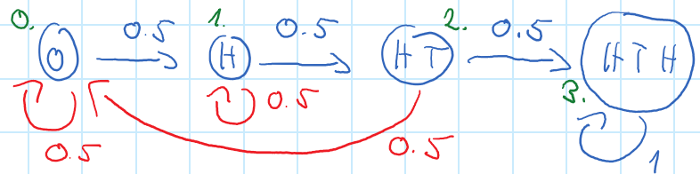
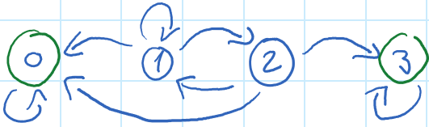

# finance

## What is a Poisson distribution? Show that it is a distribution, and what its mean and variance are.

<!-- notecardId: 1741404376410 -->
A Poisson distribution is a discrete probability distribution that expresses the probability of a given number of events occurring in a fixed interval of time or space, given that these events occur with a known constant mean rate and independently of the time since the last event.

The probability mass function (PMF) of a Poisson distribution is given by:
$$ P_\lambda(X = k) = e^{-\lambda} \frac{\lambda^k }{k!} $$

For each of the $k$ it is non-negative, and the sum of all probabilities is 1:
$$ \sum_{k=0}^{\infty} P_\lambda(X = k) = \sum_{k=0}^{\infty} e^{-\lambda} \frac{\lambda^k }{k!} = e^{-\lambda} \sum_{k=0}^{\infty} \frac{\lambda^k }{k!} = e^{-\lambda} e^{\lambda} = 1 $$

The mean:
$$ E(X) = \sum_{k=0}^{\infty} k P_\lambda(X = k) = \sum_{k=0}^{\infty} k e^{-\lambda} \frac{\lambda^k }{k!} = e^{-\lambda} \lambda \sum_{k=0}^{\infty} \frac{\lambda^{k-1}}{(k-1)!} = e^{-\lambda} \lambda e^{\lambda} = \lambda $$
The variance:
$$ E(X(X-1)) = \sum_{k=0}^{\infty} k(k-1) P_\lambda(X = k) = \sum_{k=0}^{\infty} k(k-1) e^{-\lambda} \frac{\lambda^k }{k!} = e^{-\lambda} \lambda^2 \sum_{k=0}^{\infty} \frac{\lambda^{k-2}}{(k-2)!} = e^{-\lambda} \lambda^2 e^{\lambda} = \lambda^2 $$
$$ E(X(X-1)) = E(X^2) - E(X) = \lambda^2 \Rightarrow E(X^2) = \lambda^2 + \lambda $$
$$ Var(X) = E(X^2) - E(X)^2 = \lambda^2 + \lambda - \lambda^2 = \lambda $$

## What is a binomial distribution? Given parameters $n$ and $p$, show that it is a distribution, and what its mean and variance are.

<!-- notecardId: 1741404443083 -->

A binomial distribution is a discrete probability distribution that describes the number of successes in a fixed number of independent Bernoulli trials, each with the same probability of success.
The probability mass function (PMF) of a binomial distribution is given by:
$$ P_{n,p}(X = k) = \binom{n}{k} p^k (1-p)^{n-k} $$
It is a distribution because for each of the $k$ it is non-negative, and the sum of all probabilities is 1:
$$ \sum_{k=0}^{n} P_{n,p}(X = k) = \sum_{k=0}^{n} \binom{n}{k} p^k (1-p)^{n-k} = (p + (1-p))^n = 1 $$
The mean:
$$ E(X) = E\left(\sum_{i=1}^{n} X_i\right) = \sum_{i=1}^{n} E(X_i) = \sum_{i=1}^{n} p = np $$
The variance:
$$ Var(X) = Var\left(\sum_{i=1}^{n} X_i\right) = \sum_{i=1}^{n} Var(X_i) = \sum_{i=1}^{n} p(1-p) = np(1-p)$$

## What is a geometric distribution? Given parameter $p$, show that it is a distribution, and what its mean and variance are.
<!-- notecardId: 1741404443087 -->

A geometric distribution is a discrete probability distribution that models the number of Bernoulli trials needed to get the first success. The probability mass function (PMF) of a geometric distribution is given by:
$$ P_p(X = k) = p(1-p)^{k-1} $$
It is a distribution because for each of the $k$ it is non-negative, and the sum of all probabilities is 1:
$$ \sum_{k=1}^{\infty} P_p(X = k) = \sum_{k=1}^{\infty} p(1-p)^{k-1} = p \sum_{k=0}^{\infty} (1-p)^k = p \frac{1}{p} = 1 $$
The mean:
$$ E(X) = \sum_{k=1}^{\infty} k P_p(X = k) = \sum_{k=1}^{\infty} k p(1-p)^{k-1} = p \sum_{k=0}^{\infty} (k+1)(1-p)^k = p \frac{1}{p^2} = \frac{1}{p} $$

## What is a chi-square distribution? How is it used for testing? What is its mean and variance?

<!-- notecardId: 1741574875866 -->

$$X_k=\chi_k^2 = \sum_{i=1}^{k} Z_i^2$$
where $Z_i$ are independent standard normal variables.

$$E\left(X_k\right) = \sum_{i=1}^{k} \underbrace{E\left(Z_i^2\right)}_{\underbrace{Var(Z_i)}_1 + \underbrace{E(Z_i)^2}_0} = k$$
$$Var\left(X_k\right) = \sum_{i=1}^{k} \underbrace{Var\left(Z_i^2\right)}_{\underbrace{E\left(Z_i^4\right)}_{3} - \underbrace{E\left(Z_i^2\right)^2}_1} = 2k$$

The chi-square distribution is used for testing the independence of two categorical variables in a contingency table, and for goodness-of-fit tests to see if a sample comes from a population with a specific distribution.
The chi-square test statistic is calculated as:
$$ \chi^2 = \sum_{i=1}^{k} \frac{(O_i - E_i)^2}{E_i} $$
where $O_i$ is the observed frequency and $E_i$ is the expected frequency,
and $i$ is the index of the category.

## What is a t-distribution? How can we write its distribution using other distributions?

<!-- notecardId: 1741574875870 -->

It is defined as the distribution of the ratio of a standard normal variable and the square root of a chi-square variable divided by its degrees of freedom:
$$ T_k = \frac{Z}{\sqrt{\frac{X_k}{k}}} $$
where $Z$ is a standard normal variable and $X_k$ is a chi-square variable with $k$ degrees of freedom.

This is the same as:
$$ T_{k-1} = \frac{\sum_{i=1}^{k} Z_i}{ \sigma\sqrt{k}} $$
where $Z_i$ are independent standard normal variables, and $\sigma$ is the unbiased standard deviation of the population, $\sigma^2 = \frac{1}{k-1} \sum_{i=1}^{k} (Z_i)^2$.

## When is a set function a probability-measure?

<!-- notecardId: 1741574875875 -->

A function $P$ is a probability measure if

- $P(\Omega)= 1$ 
- $P(A_i) \ge 0$
- $P\left( \biguplus_{i=1}^{\infty} A_i \right) = \sum_{i=1}^{\infty} P(A_i).$

## What is the characteristic function, what is it good for, and how to get the PDF?

<!-- notecardId: 1741574875878 -->

$$\varphi_X(t) = \mathbb{E}[e^{itX}] = \int_{-\infty}^{\infty} e^{itx} f_X(x) \,dx$$
Useful to calculate the sum of independent vars:
$$\varphi_{X+Y}(t) = \varphi_X(t) \varphi_Y(t)$$
$$f_X(x) = \frac{1}{2\pi} \int_{-\infty}^{\infty} e^{-itx} \varphi_X(t) dt$$

## What is Cauchy-distribution

<!-- notecardId: 1741574875881 -->

A Cauchy-distribution centered at 0 has a PDF:
$${f_X} \propto \frac{1}{{{c_1} + {x^2}}}$$

Its mean and variance are undefined.

## What is the conditional expected value and its properties?

<!-- notecardId: 1741574875884 -->

A random variable $Y$ is called a **conditional expectation** of $X$ given $\mathcal{F}$, symbolically $\mathbb{E}[X \mid \mathcal{F}] := Y$, if:

1. $Y$ is $\mathcal{F}$-measurable.
2. For any $A \in \mathcal{F}$, we have  
   $$ \mathbb{E}[X \mathbf{1}_A] = \mathbb{E}[Y \mathbf{1}_A]. $$

Let $(\Omega, \mathcal{A}, \mathbb{P})$ be a probability space, and let $X$ be an integrable random variable. Let $\mathcal{G} \subseteq \mathcal{F} \subseteq \mathcal{A}$ be $\sigma$-algebras, and let $Y \in L^1(\Omega, \mathcal{A}, \mathbb{P})$. Then:

1. **(Linearity)**  
   $$ \mathbb{E}[\lambda X + Y \mid \mathcal{F}] = \lambda \mathbb{E}[X \mid \mathcal{F}] + \mathbb{E}[Y \mid \mathcal{F}]. $$

2. **(Monotonicity)** If $X \geq Y$ almost surely, then  
   $$ \mathbb{E}[X \mid \mathcal{F}] \geq \mathbb{E}[Y \mid \mathcal{F}]. $$

3. If $\mathbb{E}[|XY|] < \infty$ and $Y$ is measurable with respect to $\mathcal{F}$, then  
   $$ \mathbb{E}[XY \mid \mathcal{F}] = Y \mathbb{E}[X \mid \mathcal{F}], \quad \text{and} \quad \mathbb{E}[Y \mid \mathcal{F}] = \mathbb{E}[Y \mid Y] = Y. $$

4. **(Tower Property)**  
   $$ \mathbb{E}[\mathbb{E}[X \mid \mathcal{F}] \mid \mathcal{G}] = \mathbb{E}[X \mid \mathcal{G}]. $$

5. **(Triangle Inequality)**  
   $$ \mathbb{E}[|X| \mid \mathcal{F}] \geq |\mathbb{E}[X \mid \mathcal{F}]|. $$

6. **(Independence)** If $X$ is independent of $\mathcal{F}$, then  
   $$ \mathbb{E}[X \mid \mathcal{F}] = \mathbb{E}[X]. $$

7. If $\mathbb{P}[A] \in \{0,1\}$ for any $A \in \mathcal{F}$, then  
   $$ \mathbb{E}[X \mid \mathcal{F}] = \mathbb{E}[X]. $$

8. **(Dominated Convergence Theorem)** Assume $Y \in L^1(\mathbb{P})$, $Y \geq 0$, and let $(X_n)_{n \in \mathbb{N}}$ be a sequence of random variables such that $|X_n| \leq Y$ for all $n \in \mathbb{N}$ and  
   $$X_n \xrightarrow{n \to \infty} X \quad \text{a.s.}$$  
   Then,  
   $$\lim_{n \to \infty} \mathbb{E}[X_n \mid \mathcal{F}] = \mathbb{E}[X \mid \mathcal{F}]$$  
   almost surely and in $L^1(\mathbb{P})$.

## Why is the conditional expectation the best estimator?

<!-- notecardId: 1741574875887 -->

We consider the candidate estimator $ Z = \mathbb{E}[X \mid \mathcal{G}] + W $, where $W $ is some $\mathcal{G}$-measurable adjustment term. Substituting this into the MSE:

$$\mathbb{E}[(X - Z)^2] = \mathbb{E}[(X - (\mathbb{E}[X \mid \mathcal{G}] + W))^2]$$
$$\mathbb{E}[(X - \mathbb{E}[X \mid \mathcal{G}])^2 - 2 W (X - \mathbb{E}[X \mid \mathcal{G}]) + W^2]$$

Using the **orthogonality property** of conditional expectation:

$$\mathbb{E}[(X - \mathbb{E}[X \mid \mathcal{G}]) W] = 0 \quad \text{for any } W \text{ that is } \mathcal{G}\text{-measurable}$$

$$\mathbb{E}[(X - Z)^2] = \mathbb{E}[(X - \mathbb{E}[X \mid \mathcal{G}])^2] + \mathbb{E}[W^2]$$

## Why is a random walk a martingale?

<!-- notecardId: 1741574875890 -->

A random walk is a martingale because its expected future value, given the past, is equal to its current value. Mathematically, if we define a simple symmetric random walk as:

$$
X_n = X_{n-1} + Z_n
$$

where $Z_n$ are independent and identically distributed (i.i.d.) random variables with mean zero, then we have:

$$
E[X_n \mid X_{n-1}, X_{n-2}, \dots, X_0] = X_{n-1} + E[Z_n] = X_{n-1}
$$

Since $E[Z_n] = 0$, it follows that:

$$
E[X_n \mid \mathcal{F}_{n-1}] = X_{n-1}
$$

where $\mathcal{F}_{n-1}$ is the filtration representing all information up to time $n-1 $. This satisfies the martingale property:

$$
E[X_n \mid \mathcal{F}_{n-1}] = X_{n-1}
$$

Thus, a random walk is a martingale.

## What is a filtration in probability theory? How is it related to adaptation?

<!-- notecardId: 1741574875893 -->

A **filtration** is a sequence of $\sigma$-algebras $\{\mathcal{F}_t\}_{t \geq 0}$ that represents the information available over time. It satisfies:

1. **Increasing property**: If $s \leq t$, then $\mathcal{F}_s \subseteq \mathcal{F}_t$, meaning that as time progresses, more information is available.
2. **Adaptation**: A stochastic process $\{X_t\}$ is said to be adapted to a filtration $\{\mathcal{F}_t\}$ if $X_t$ is $\mathcal{F}_t$-measurable for each $t$.

Filtrations are used to formalize the concept of evolving information in probability and finance.

## What are the greek letters used in finance?

<!-- notecardId: 1741749659396 -->

$\Delta$ is the sensitivity of the option price to changes in the underlying asset price.
$$\Delta = \frac{\partial V}{\partial S}$$

$\Gamma$ is the sensitivity of the option price to changes in the delta of the underlying asset price.
$$\Gamma = \frac{\partial^2 V}{\partial S^2}$$

$\Theta$ is the sensitivity of the option price to changes in time (and not the maturity)
$$\Theta = \frac{\partial V}{\partial t}$$

$\Rho$ is the sensitivity of the option price to changes in the interest rate.
$$\Rho = \frac{\partial V}{\partial r}$$

$Vega$ is the sensitivity of the option price to changes in the volatility of the underlying asset.
$$Vega = \frac{\partial V}{\partial \sigma}$$

## What is the sign of $\Delta$ for a long and short call and put?

| option position | hedge position | sign of option delta |
| --------------- | -------------- | -------------------- |
| long call       | short asset    | positive             |
| short call      | long asset     | negative             |
| long put        | long asset     | negative             |
| short put       | short asset    | positive             |

## How to make a portfolio $\Delta$ and $\Gamma$ neutral?

A portfolio is $\Delta$ and $\Gamma$ neutral if the following conditions are satisfied:

1. The sum of the deltas of all positions in the portfolio is zero:
   $$ \sum_{i=1}^{n} \Delta_i = 0 $$
2. The sum of the gammas of all positions in the portfolio is zero:
   $$ \sum_{i=1}^{n} \Gamma_i = 0 $$

If we have a portfolio,
we need at least 2 more asstes $D_1$ and $D_2$ to make it $\Delta$ and $\Gamma$ netural.
The value of the portfolio:
$$\Pi = V + x_1 D_1 + x_2 D_2$$
We can calculate the delta and gamma of the portfolio:
$$\Delta_{\Pi} = \Delta + x_1 \Delta_{D_1} + x_2 \Delta_{D_2} = 0$$
$$\Gamma_{\Pi} = \Gamma + x_1 \Gamma_{D_1} + x_2 \Gamma_{D_2} = 0$$
Theser are 2 equations with 2 unknowns $x_1$ and $x_2$, which can be solved if the $\frac{\Delta_{D_1}}{\Gamma_{D_1}} \neq \frac{\Delta_{D_2}}{\Gamma_{D_2}}$.

## What is the result of the slope in OLS for a linear regression?

<!-- notecardId: 1741749659409 -->

If both $Y$ and $X$ are centered, the slope $m$ is given by:
The slope $m$ is given by:
$$\arg\min_m E\left[(Y - mX)^2\right] = \arg\min_m E\left[Y^2 - 2mXY + m^2X^2\right]$$
$$= \arg\min_m E[Y^2] - 2mE[XY] + m^2E[X^2]$$
It is a quadratic function of $m$, and the minimum is at:
$$m = \frac{E[XY]}{E[X^2]} = \frac{\text{Cov}(X,Y)}{\text{Var}(X)}$$

## For the expected number of steps to reach a state in a Markov chain, e.g. to reach HTH, how to write up the equations?

<!-- notecardId: 1741749659411 -->

Let $h_i$ be the expected number of steps to reach state $3$ from state $i$.
$$\begin{align*}
  {h_3} &= 0  \\
  {h_2} &= \frac{1}{2}\left( {1 + {h_3}} \right) + \frac{1}{2}\left( {1 + {h_0}} \right)  \\
  {h_1} &= \frac{1}{2}\left( {1 + {h_2}} \right) + \frac{1}{2}\left( {1 + {h_1}} \right)  \\
  {h_0} &= \frac{1}{2}\left( {1 + {h_0}} \right) + \frac{1}{2}\left( {1 + {h_1}} \right)  \\ 
\end{align*}$$

## How to tell what the probability is to reach a state earlier than another state in a Markow chain?

What is the probability that we reach state $3$ before state $0$ in the following Markov chain?

%

Let $h_i$ denote the probability that we reach state $3$ before state $0$.

$$\begin{align*}
  {h_3} &= 1\quad {h_0} = 0 \\
  {h_2} &= {p_{23}}{h_3} + {p_{20}}{h_0} + {p_{21}}{h_1}  \\
  {h_1} &= {p_{11}}{h_1} + {p_{12}}{h_2} + {p_{10}}{h_0}  \\ 
\end{align*}$$

## What is the reflection principle? What is the key idea for the proof?

<!-- notecardId: 1741749659416 -->

$$P\left( {\mathop {\sup }\limits_{0 \leqslant s \leqslant t} W\left( s \right) \geqslant a} \right) = 2P\left( {W\left( t \right) \geqslant a} \right)$$

Proof:
$$\begin{alignat}{3}
  P\left( {\mathop {\sup }\limits_{0 \leqslant s \leqslant t} W\left( s \right) \geqslant a} \right) =  & P\left( {\mathop {\sup }\limits_{0 \leqslant s \leqslant t} W\left( s \right) \geqslant a \cap W\left( t \right) \geqslant {\tau _a}} \right) && +  P\left( {\mathop {\sup }\limits_{0 \leqslant s \leqslant t} W\left( s \right) \geqslant a \cap W\left( t \right) < {\tau _a}} \right) \\ 
   =  & P\left( {W\left( t \right) \geqslant {\tau _a}} \right) && +P\left( {\mathop {\sup }\limits_{0 \leqslant s \leqslant t} W\left( s \right) \geqslant a \cap W\left( t \right) \geqslant {\tau _a}} \right) \\ 
   = & P\left( {W\left( t \right) \geqslant {\tau _a}} \right) && + P\left( {W\left( t \right) \geqslant {\tau _a}} \right) \\
   =& 2 P\left( {W\left( t \right) \geqslant {\tau _a}} \right) \\ 
\end{alignat}$$

- Eq.1: law of total probability.
- Eq.2: tower property in the left term, and we use the fact that Brownian motion is symmetric, on the right term.
- E1.3 tower property again.

## Let $X_1 = 1- 2Z_1$, $X_2 = 3 +Z_2$, $Z_1$ and $Z_2$ are independent standard normal variables. What is the distribution of $X_1 + X_2$?

For the mean and variance, we know that:
$$E(X_1 + X_2) = E(X_1) + E(X_2) = 0 + 3 = 3$$
$$Var(X_1 + X_2) = Var(X_1) + Var(X_2) = 4 + 1 = 5$$
Thus, $X_1 + X_2 = 3+\sqrt{5}Z \sim N(3, 5)$, where $Z$ is a standard normal variable.

## Let $ln(Y_1) = 1- 2Z_1$, $ln(Y_2) = 3 + Z_2$, $Z_1$ and $Z_2$ are independent standard normal variables. What is the distribution of $Y_1 + Y_2$ and $Y_1 \cdot Y_2$?

$Y_1 \sim logN(1,4)$ and $Y_2 \sim logN(3,1)$. 
For the product, we know that:
$$ln(Y_1 \cdot Y_2) = ln(Y_1) + ln(Y_2) = X_1 + X_2$$
where $X_i$ are independent standard normal variables,
$$ln(Y_1 \cdot Y_2)  \sim N(1,4) + N(3,1) = N(4,5)$$
Thus, $Y_1 \cdot Y_2 = e^{X_1 + X_2} \sim logN(4,5)$.

For the sum, it is not a normal or lognormal distribution.

## What is the differential form of the asset price and the solution of the SDE?

<!-- notecardId: 1741749659423 -->

$$dS_t = \mu -q S_t dt + \sigma S_t dW_t$$
where $W_t$ is a standard Brownian motion. Solution:
$$ln({S_t}/{S_0}) = \left( {\mu  - q - \frac{{{\sigma ^2}}}{2}} \right)t + \sigma \sqrt t Z$$
where $Z$ is a standard normal variable.

## How to calculate the risk-free price of a call option using the Black-Scholes formula?

<!-- notecardId: 1741749659426 -->

$$C_0 = e^{-rT} \mathbb{E}^Q\left[ \max(S_T - K, 0) \right] = {e^{ - qT}}{S_0}N\left( {{d_1}} \right) - {e^{ - rT}}K \cdot N\left( {{d_2}} \right)$$
where $S_T$ is the stock price at time $T$, $K$ is the strike price, $r$ is the risk-free interest rate, $Q$ is the risk-neutral measure, $d_2 = \frac{{\ln \left( {\frac{K}{{{S_0}}}} \right) - \left( {r  - q - \frac{{{\sigma ^2}}}{2}} \right)T}}{{\sigma \sqrt T }}$, and $d_1 = d_2 + \sigma \sqrt T$.

$$\begin{aligned}
  P^Q({S_T} \geqslant K) \Leftrightarrow  & {S_0}{e^{\left( {r  - q - \frac{{{\sigma ^2}}}{2}} \right)T + \sigma \sqrt T Z}} \geqslant K \\
   \Leftrightarrow  & Z \geqslant \frac{{\ln \left( {\frac{K}{{{S_1}}}} \right) - \left( {r  - q - \frac{{{\sigma ^2}}}{2}} \right)T}}{{\sigma \sqrt T }}: = -{d_2} \\
\end{aligned}$$

$$\begin{alignat*}{3}
  {C_0} =  & {e^{ - rT}}\int\limits_{ - {d_2}}^\infty  {\left( {S\left( T \right) - K} \right){f_Z}\left( x \right)\,dx}  \\ 
   =  & {e^{ - rT}}\int\limits_{ - {d_2}}^\infty  {S\left( T \right){f_Z}\left( x \right)\,dx}  - {e^{ - rT}}K \cdot N\left( {{d_2}} \right)\quad \int\limits_{ - \infty }^c {{e^{ - \frac{{{x^2}}}{2}}}dx}  = \int\limits_{ - c}^\infty  {{e^{ - \frac{{{x^2}}}{2}}}dx}  = \sqrt {2\pi } N\left( c \right) \\ 
   =  & {e^{ - rT}}\frac{1}{{\sqrt {2\pi } }}\int\limits_{ - {d_2}}^\infty  {\left( {{S_0}{e^{\left( {r - q - \frac{{{\sigma ^2}}}{2}} \right)T + \sigma \sqrt T x}}} \right){e^{ - \frac{{{x^2}}}{2}}}\,dx - {e^{ - rT}}K \cdot N\left( {{d_2}} \right)}  \\ 
   =  & {e^{ - qT}}{S_0}\frac{1}{{\sqrt {2\pi } }}\int\limits_{ - {d_2}}^\infty  {{e^{\overbrace { - \frac{{{\sigma ^2}}}{2}T + \sigma \sqrt T x - \frac{{{x^2}}}{2}}^{ - \frac{1}{2}{{\left( {x - \sigma \sqrt T } \right)}^2}}}}\,dx}  - {e^{ - rT}}K \cdot N\left( {{d_2}} \right)\quad x - \sigma \sqrt T : = y \\ 
   =  & {e^{ - qT}}{S_0}\frac{1}{{\sqrt {2\pi } }}\int\limits_{\underbrace { - {d_2} - \sigma \sqrt T }_{: =  - {d_1}}}^\infty  {{e^{ - \frac{1}{2}{y^2}}}\,dy}  - {e^{ - rT}}K \cdot N\left( {{d_2}} \right) \\ 
   =  & {e^{ - qT}}{S_0}\frac{1}{{\sqrt {2\pi } }}\int\limits_{\underbrace { - {d_2} - \sigma \sqrt T }_{: =  - {d_1}}}^\infty  {{e^{ - \frac{1}{2}{y^2}}}\,dy}  - {e^{ - rT}}K \cdot N\left( {{d_2}} \right) \\ 
   =  & {e^{ - qT}}{S_0}N\left( {{d_1}} \right) - {e^{ - rT}}K \cdot N\left( {{d_2}} \right) \\
\end{alignat*}$$

## What is Brownian motion?

<!-- notecardId: 1741749659428 -->

A stochastic process $W_t$ is called a Brownian motion if it satisfies the following properties:
1. **$W_0 = 0$**: The process starts at zero.
2. **Independent increments**: For any $0 \leq t_1 < t_2 < \ldots < t_n$, the increments $W_{t_2} - W_{t_1}, W_{t_3} - W_{t_2}, \ldots, W_{t_n} - W_{t_{n-1}}$ are independent random variables with distribution $W_{t_i} - W_{t_{i-1}} = N(0, t_i - t_{i-1})$.
3. The paths $t\mapsto W_t$ are continuous with probability 1.

## What is a multivariate normal distribution?

<!-- notecardId: 1741749659431 -->

$$\phi(x) = \frac{1}{(2\pi)^{n/2} \sqrt{\det(\Sigma)}}\exp\left(- \frac{1}{2} (x-\mu)^t \Sigma^{-1} (x-\mu)\right) \quad x\in\mathbb{R}^n$$
where $\mu$ is the mean vector and $\Sigma$ is the covariance matrix, positive definite.

## Given a uniform distribution, how to get a desired distribution?

<!-- notecardId: 1741749659433 -->

$${F_X}(x) = P\left( {X \leqslant x} \right)\mathop  = \limits^{\exists ?T:} P\left( {T\left( U \right) \leqslant x} \right) = P\left( {U \leqslant {T^{ - 1}}\left( x \right)} \right) = {T^{ - 1}}\left( x \right)$$

So if we take the CDF of the desired distribution, and invert it, applying this to a uniform distribution, we get the desired distribution.
