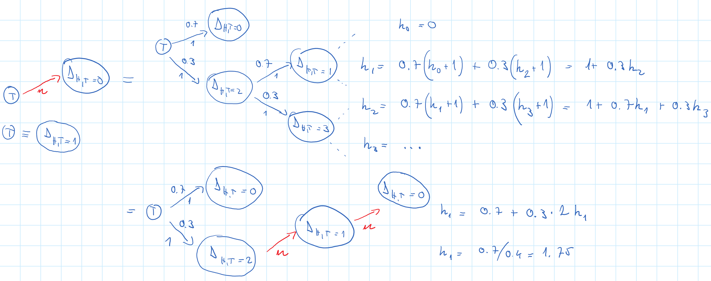
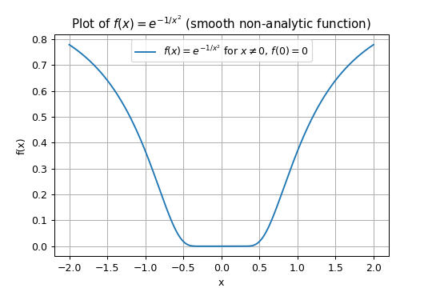
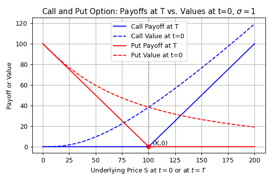

# Finance

## What is the Fourier transformation of the Gaussian curve?

<!-- notecardId: 1742762218926 -->

$$\hat{f}(k) = \int_{-\infty}^{\infty} e^{-ikx} \exp\left(-\frac{x^2}{2\sigma^2}\right) dx$$

Combine exponents:

$$\exp\left(-\frac{x^2}{2\sigma^2}\right) e^{-ikx}=\exp\left[-\frac{1}{2\sigma^2} \left(x^2 + 2i\sigma^2 kx\right)\right]$$

Complete the square

$$x^2 + 2i\sigma^2 kx=\left(x + i\sigma^2 k\right)^2 + \sigma^4 k^2\quad\Longrightarrow\quad-\frac{1}{2\sigma^2} \left[x^2 + 2i\sigma^2 kx\right]=-\frac{\left(x + i\sigma^2 k\right)^2}{2\sigma^2}- \frac{\sigma^2 k^2}{2}$$

Separate out the constant term

$$\hat{f}(k)=\int_{-\infty}^{\infty}\exp\left(-\frac{\sigma^2 k^2}{2}\right)\exp\left[-\frac{(x + i\sigma^2 k)^2}{2\sigma^2}\right]dx=e^{-\frac{\sigma^2 k^2}{2}}\int_{-\infty}^{\infty}\exp\left[-\frac{(x + i\sigma^2 k)^2}{2\sigma^2}\right]dx$$

Substitute $u = x + i\sigma^2 k$. The contour shifts in the complex plane but the Gaussian integral is unaffected, so

$$\int_{-\infty}^{\infty}e^{-u^2/(2\sigma^2)}du= \sqrt{2\pi} \sigma$$
Hence,

$$\hat{f}(k)=\sqrt{2\pi} \sigma \exp\left(-\frac{\sigma^2 k^2}{2}\right)$$

### Shift Property for an Arbitrary Function

$$\hat{g}(k)=\int_{-\infty}^{\infty}e^{-ikx}f(x - x_0)dx$$

Let $u = x - x_0 \Rightarrow x = u + x_0$:

$$\hat{g}(k)=\int_{-\infty}^{\infty}e^{-ik(u + x_0)} f(u)du=e^{-ikx_0}\int_{-\infty}^{\infty}e^{-iku} f(u)du= e^{-ikx_0} \hat{f}(k)$$

## What is an estimate what is an estimator?

<!-- notecardId: 1742687802857 -->

The estimator is a function of the sample data, while the estimate is the value of the estimator for a given sample.

## What is bias in OLS?

<!-- notecardId: 1742687802859 -->

The bias of an estimator is the difference between the expected value of the estimator and the true value of the parameter being estimated.

## How do you solve a 2nd order differential equation?

<!-- notecardId: 1742687802861 -->

$$
y'' + b y' + c y = 0
$$

Ansatz: $y(x) = e^{r x}$, the general solution is the linear combination of the particular solutions.
$$y' = r e^{r x}, \quad y'' = r^2 e^{r x}$$

$$r^2 e^{r x} + b r e^{r x} + c e^{r x} = 0$$
$$r^2 + b r + c = 0$$

Case 1: Two Distinct Real Roots. 

Let $r_1$ and $r_2$ be the real roots. Then:

$$
y(x) = C_1 e^{r_1 x} + C_2 e^{r_2 x}
$$

---

Case 2:  the two linearly independent solutions are:

$$
y_1(x) = e^{r x}, \quad y_2(x) = x e^{r x}
$$

So the general solution is:

$$
y(x) = (C_1 + C_2 x) e^{r x}
$$

In the limit when distance between the 2 roots is small, we can write one solution as the mean of the two roots, and the other as the distance between the two roots, $r_2 = r_1 + \varepsilon$:
$$
y_1(x) = e^{\frac{r_1 + r_2}{2} x}, \quad y_2(x) = \frac{e^{r_2 x} - e^{r_1 x}}{r_2 - r_1} = \frac{e^{(r_1 + \varepsilon) x} - e^{r_1 x}}{\varepsilon} = \frac{e^{r_1 x} (e^{\varepsilon x}-1)}{\varepsilon} \approx \frac{e^{r_1 x} \varepsilon x}{\varepsilon} = e^{r_1 x} x
$$

---

Case 3: Complex Conjugate Roots:
$$
r_{1,2} \;=\; \alpha \,\pm\, i\,\omega
\quad\text{where}\quad
\alpha = -1/2,\quad \omega = \sqrt{\bigl|b^2-4c\bigr|}/2.
$$
Then the general solution is:
$$
y(x) = e^{\alpha x} \Bigl(C_1 \cos(\omega x) + C_2 \sin(\omega x)\Bigr)
$$

## Let's say we have a biased coin and flipped T already (which the probability 0.7). How many flips do we need to have the same number of heads and tails?

<!-- notecardId: 1742687802864 -->

## We flip a fair dice 5 times. What is the variance of the frequency of 1s and 2s?

<!-- notecardId: 1742687802865 -->

We roll a fair die 5 times. Let $X_{i1} = 1$ if the $i$-th roll is a 1, and $0$ otherwise. 
Let $X_{i2} = 1$ if the $i$-th roll is a 2, and $0$ otherwise.$T = \sum_{i=1}^5 (X_{i1} + X_{i2})$. What is its variance?
$$
\operatorname{Var}(T) = \sum_{i=1}^5 \operatorname{Var}(X_{i1} + X_{i2})
$$

$$
\operatorname{Var}(X_{i1} + X_{i2}) = \operatorname{Var}(X_{i1}) + \operatorname{Var}(X_{i2}) + 2 \operatorname{Cov}(X_{i1}, X_{i2})
$$

$$
\mathbb{E}[X_{i1}] = \mathbb{E}[X_{i2}] = \frac{1}{6}, \quad
\operatorname{Var}(X_{i1}) = \operatorname{Var}(X_{i2}) = \mathbb{E}[X_{i1}^2] - \mathbb{E}[X_{i1}]^2 = \frac{1}{6} - \left( \frac{1}{6} \right)^2 = \frac{5}{36}
$$

$$
\mathbb{E}[X_{i1} X_{i2}] = 0, \quad
\operatorname{Cov}(X_{i1}, X_{i2}) = \mathbb{E}[X_{i1} X_{i2}] - \mathbb{E}[X_{i1}] \mathbb{E}[X_{i2}] = -\frac{1}{36}
$$

Substitute:

$$
\operatorname{Var}(X_{i1} + X_{i2}) = \frac{5}{36} + \frac{5}{36} + 2 \cdot \left( -\frac{1}{36} \right) = \frac{8}{36} = \frac{2}{9}
$$

$$
\operatorname{Var}(T) = 5 \cdot \frac{2}{9} = \frac{10}{9}
$$

## We have a fair dice, and another dice with 6 faces, integer values, and arbitrary probabilities. How to set the face values and probabilities of the 2nd dice to that the sum of the two dices is uniform from 1 to 12?

<!-- notecardId: 1742687802867 -->

We must have a 0 and 6 at least once. If they had the same probability, the sum would be uniform. So we can set the 0 and 6 to have a probability of 1/2, and the rest to 0,
meaning it has only 0s and 6s. If it had a face with value 1 and non0 probability, the sum would not have the same probability between 1 and 2, because we could get

- 1 with 0 and 1, and
- 2 with 0 and 2 or 1 and 1, and the probability is bigger than the previous one by the probability of getting 1 and 1.

So we don't have 1. Similarly, the probability of 2 on the 2nd dice is 0 too with similar reasoning. As well as the others.

## What is the logistic activation function? What is the formula for softmax activation?

<!-- notecardId: 1742749372224 -->

$$P\left( x \right)=\frac{1}{1+{{e}^{-\left( x-\mu  \right)/s}}}$$

For $N$ classes:
$$P\left( \left. \text{class}=k \right|x \right)=\frac{{{e}^{\mathbf{w}_{k}^{T}\mathbf{x}+{{b}_{k}}}}}{\sum\limits_{j=1}^{N}{{{e}^{\mathbf{w}_{j}^{T}\mathbf{x}+{{b}_{j}}}}}}$$

## What are the eigenvalues of a triangular matrix? Why?

<!-- notecardId: 1742687802870 -->

The eigenvalues of a triangular matrix are the diagonal elements of the matrix.

This can be seen from the characteristic equation.

## List financial derivatives

<!-- notecardId: 1742687802872 -->

Forwards, futures, options, swaps.

## Show me an example when a function has minimum, but both its first and derivatives are zero.

<!-- notecardId: 1742687802874 -->

$$
f(x) = \begin{cases}
e^{-\frac{1}{x^2}} & \text{if } x \neq 0 \\
0 & \text{if } x = 0
\end{cases}
$$

[math.stackexchange.com](https://math.stackexchange.com/questions/2994556/show-that-fx-0-if-x-0-fx-textexp-1-x2-if-x-neq-0-is-i)

## Does increasing volatility always increase the value of a European put or call option?

<!-- notecardId: 1742758903934 -->

Yes.

## How a decision tree is built for classification and regression?

<!-- notecardId: 1742768229866 -->

We assume you are given training data:

$$\{(x_1, y_1), (x_2, y_2), \ldots, (x_n, y_n)\}$$

- Each $ x_i \in \mathbb{R} $ (a single feature)
- Each $ y_i \in \mathbb{R} $ for **regression**, or $ y_i \in \{1, 2, \ldots, K\} $ for **classification**

---

### Splitting the Data

At each node, we consider all possible split points $ s \in \mathbb{R} $, and divide the dataset into:

- **Left child**: $ \{(x_i, y_i) \mid x_i \leq s\} $
- **Right child**: $ \{(x_i, y_i) \mid x_i > s\} $

---

### Regression: Mean Squared Error (MSE)

Define:

- $ L(s) = \{ y_i \mid x_i \leq s \} $
- $ R(s) = \{ y_i \mid x_i > s \} $
- $ \bar{y}_L = \dfrac{1}{|L(s)|} \sum_{y \in L(s)} y $
- $ \bar{y}_R = \dfrac{1}{|R(s)|} \sum_{y \in R(s)} y $

**Split loss function:**

$$\text{MSE}(s) = \sum_{y \in L(s)} (y - \bar{y}_L)^2 + \sum_{y \in R(s)} (y - \bar{y}_R)^2$$

**Best split:**

$$s^* = \arg\min_s \text{MSE}(s)$$

---

### Classification: Gini Impurity

Let $ K $ be the number of distinct classes in the dataset (e.g., 2 for binary classification).

#### Gini impurity for a node:

$$G = 1 - \sum_{k=1}^{K} p_k^2$$

where $ p_k $ is the **proportion of samples of class $ k $** in the node:

$$p_k = \dfrac{\text{number of samples in class } k}{\text{total samples in node}}$$

#### Gini at a split $ s $:

- Let $ G_L $ and $ G_R $ be Gini impurities of the left and right child nodes.
- Let $ n = |L(s)| + |R(s)| $

Then:

$$\text{Gini}(s) = \frac{|L(s)|}{n} \cdot G_L + \frac{|R(s)|}{n} \cdot G_R$$

**Best split:**

$$s^* = \arg\min_s \text{Gini}(s)$$

---

### Recursive Tree Building

After finding $ s^* $, we recursively apply the same procedure to the left and right subsets until a stopping condition is met.

---

### Stopping Criteria

Common criteria to stop splitting:

- Node is **pure** (all labels the same)
- Max tree **depth** reached
- Node contains fewer than `min_samples_split`
- Impurity reduction is below a threshold

---

#### Cost-Complexity Pruning

After growing the full tree, prune it back by minimizing:

$$R_\alpha(T) = R(T) + \alpha \cdot |T|$$

- $ R(T) $: total loss (e.g., total MSE)
- $ |T| $: number of leaves
- $ \alpha $: regularization parameter

### Summary

| Task           | Criterion                      | Formula                                                                |
| -------------- | ------------------------------ | ---------------------------------------------------------------------- |
| Regression     | Mean Squared Error             | $ \text{MSE}(s) $                                                      |
| Classification | Gini Impurity                  | $ \text{Gini}(s) $                                                     |
| Gini term      | Class proportion               | $ p_k = \frac{\text{# of samples in class } k}{\text{total samples}} $ |
| Pruning        | Cost-complexity regularization | $ R_\alpha(T) = R(T) + \alpha \cdot  num_T                             |

