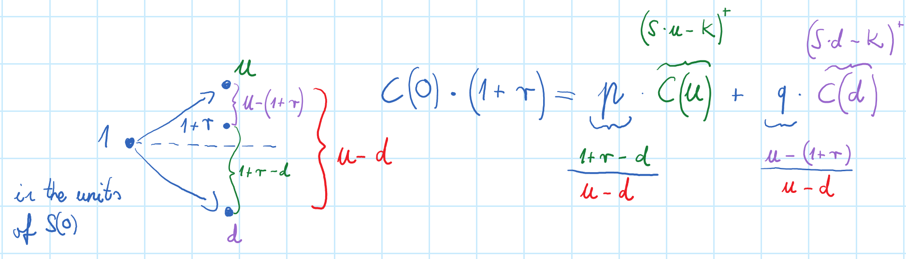
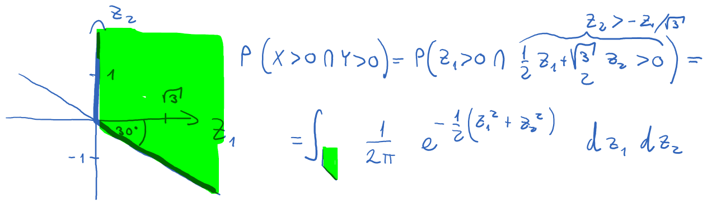
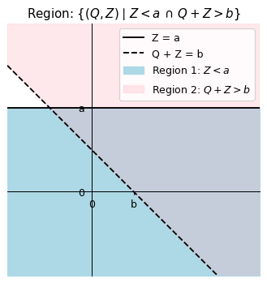
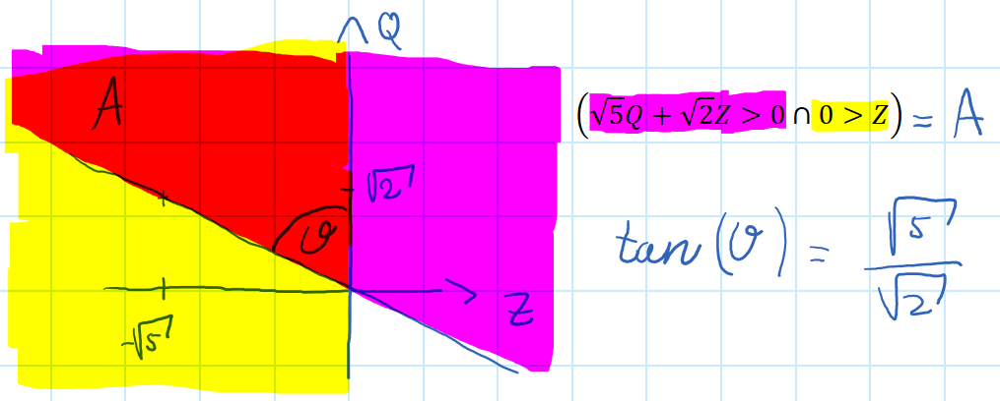

# Finance

## In the 1 time binomial model, price a European call option with strike $K$ and maturity $T$ on a stock with current price $S_0$. The stock can go up by a factor of $u$ or down by a factor of $d$ in the next time step. The risk-free interest rate is $r$. How about 2 periods or more? How about barrier options?

<!-- notecardId: 1743912241762 -->

$$C_0 \cdot (1+r) =  \left( p C_u + q C_d \right)$$

- $C_u = \max(S_0 u - K, 0)$
- $C_d = \max(S_0 d - K, 0)$
- $p = \frac{(1+r) - d}{u - d}$
- $q = 1 - p = \frac{u - (1+r)}{u - d}$

For 2 periods:
$$C\left( 0 \right)\cdot{{\left( 1+r \right)}^{2}}={{p}^{2}}C_{u^2}+2pqC_{ud}+q^2C_{d^2}$$

In general, the factor $C\left( S_0 u^i d^{n-i} \right)$ is the payoff of the option at time $T$ for $i$ up moves and $n-i$ down moves, and its risk-neutral probability is $p^i q^{n-i}$. This is multiplied by the number of ways to have $i$ up moves and $n-i$ down moves, which is $\binom{n}{i}$.

For up-and-out barrier options, the option is worthless if the stock price exceeds a certain barrier level, and the number of ways to have $i$ up moves and $n-i$ down moves is limited by the barrier, hence the multiplier is $\le \binom{n}{i}$.

## If $X$ follows an exponential distribution with parameter $\lambda$, what is the probability that it is bigger than 27, given that it is bigger than 10?

<!-- notecardId: 1743997059987 -->

$$P(X > 27 | X > 10) = \frac{P(X > 27)}{P(X > 10)} = \frac{1-P(X \le 27)}{1-P(X \le 10)} = \frac{e^{-\lambda \cdot 27}}{e^{-\lambda \cdot 10}} = e^{-\lambda \cdot 17} = P(X > 17)$$

## $X$ and $Y$ has bivariate normal distribution with covariance matrix $\Sigma = \begin{pmatrix} 1 & 1/2 \\ 1/2 & 1 \end{pmatrix}$. What is $P(X > 0 \cap Y > 0)$?

<!-- notecardId: 1743996975802 -->

Find standard normal variables $Z_1$ and $Z_2$ such that $X = \alpha Z_1$ and $Y = \beta Z_1 + \gamma Z_2$.

- 1 = $\Sigma_{1,1} = Var(X) = Var(\alpha Z_1) = \alpha^2 \implies \alpha = 1$
- $\frac{1}{2} = \Sigma_{1,2} = Cov(X,Y) = Cov(Z_1, \beta Z_1 + \gamma Z_2) = Var(Z_1) \beta + \underbrace{Cov(Z_1, Z_2)}_{\text{indp.}\implies =0} \gamma = \beta$
- $1 = \Sigma_{2,2} = Var(Y) = Var(Z_1/2 + \gamma Z_2) = \frac{1}{4} + \gamma^2 \implies \gamma = \frac{\sqrt{3}}{2}$

Then $X=Z_1$ and $Y = Z_1 + \frac{\sqrt{3}}{2} Z_2$. The condition $P(X > 0 \cap Y > 0) \Leftrightarrow P(Z_1 > 0 \cap \frac{1}{2}Z_1 + \frac{\sqrt{3}}{2} Z_2 > 0) = P(Z_1 > 0 \cap Z_2 > -\frac{1}{\sqrt{3}} Z_1)$

$$I=\int_{0}^{\infty }{dr\cdot r\int_{0}^{2\pi /3}{d\theta \frac{1}{2\pi }{{e}^{-\frac{1}{2}\left( z_{1}^{2}+z_{2}^{2} \right)}}}}=\frac{2\pi /3}{2\pi }\int_{0}^{\infty }{dr\cdot r{{e}^{-\frac{1}{2}{{r}^{2}}}}}=\frac{1}{3}\left. {{e}^{-\frac{1}{2}{{r}^{2}}}} \right|_{0}^{\infty }=\frac{1}{3}$$

## Integral variable change formula in 2D and do polar coordinates in 3D

<!-- notecardId: 1744001261918 -->

$$\int\!\int_{R} f(x,y)\,dx\,dy 
= \int\!\int_{S} f\bigl(x(u,v),y(u,v)\bigr)\,\biggl|\det\!\Bigl(\frac{\partial(x,y)}{\partial(u,v)}\Bigr)\biggr|\,du\,dv.
$$

$$
\iiint_{x^2+y^2+z^2 \le a^2} 1\,dx\,dy\,dz
=
\int_{0}^{2\pi}\int_{0}^{\pi}\int_{0}^{a} r^2 \sin\phi\,dr\,d\phi\,d\theta
=
\frac{4\pi a^3}{3}.
$$

- $x=r\sin\phi\cos\theta$
- $y=r\sin\phi\sin\theta$
- $z=r\cos\phi$, and
- The Jacobian is $J = \left| \frac{\partial(x,y,z)}{\partial(r,\phi,\theta)} \right| = \det\begin{pmatrix} \sin\phi\cos\theta & r\cos\phi\cos\theta & -r\sin\phi\sin\theta \\ \sin\phi\sin\theta & r\cos\phi\sin\theta & r\sin\phi\cos\theta \\ \cos\phi & -r\sin\phi & 0 \end{pmatrix} = r^2\sin\phi.$
- so $dx\,dy\,dz = r^2\sin\phi\,dr\,d\phi\,d\theta.$

## Show that a Negative Binomial random variable $\mathrm{NB}(n,p)$ defined as the number of Bernoulli$(p)$ trials needed to achieve $n$ successes, can be represented as the sum of $n$ i.i.d. Geometric$(p)$ random variables.

1. $\mathrm{Geom}(p)$ is the distribution of the number of Bernoulli$(p)$ trials until one success.  
2. After each success, the process “resets” (memoryless property), so waiting for the next success is again $\mathrm{Geom}(p)$.  
3. Summing $n$ such waiting times (each $\mathrm{Geom}(p)$, i.i.d.) gives the total number of trials until $n$ successes:
$$\mathrm{NB}(n,p) = X_1 + X_2 + \cdots + X_n$$
where $X_i \sim \mathrm{Geom}(p)$ independently.

## Show $\lim_{n \to \infty} \sum_{k = n}^{3n} \binom{k-1}{n-1}\left(\frac{1}{3}\right)n \left(\frac{2}{3}\right)^{k-n} = ?$

$$
   \sum_{k = n}^{3n} \binom{k-1}{n-1}
   \left(\frac{1}{3}\right)^n \left(\frac{2}{3}\right)^{k-n}
   =
   \Pr\bigl(X_n \le 3n\bigr)
$$
where $X_n \sim \mathrm{NB}\left(n, p = \frac13\right)$ (i.e., the Negative Binomial distribution with parameters $n$ and $p = 1/3$).

- $E\left[X_n\right] = n\cdot \frac1p = 3n$.
- $Var\left[X_n\right] = n\frac{(1-p)}{p^2} = n\frac{2}{\frac{1}{3}} = 6n$
- $X_n \sim \mathrm{NB}\left(n, p = \frac13\right)$ is asymptotically normal as $n \to \infty$ with mean $3n$ and variance $6n$, so by the Central Limit Theorem, we can standardize it:

    $$
    \frac{X_n - 3n}{\sqrt{6n}} \xrightarrow{d} N(0,1)
    $$

$$\Pr\bigl(X_n \le 3n\bigr) = \Pr\left(\frac{X_n - 3n}{\sqrt{6n}} \le 0\right) \to \Phi(0) = \frac12$$

## Calculate $\lim_{n \to \infty} \int_{[0,1]^n} \frac{x_1^5 + x_2^5 + \cdots + x_n^5}{x_1^4 + x_2^4 + \cdots + x_n^4}\,dx_1\,dx_2 \cdots dx_n$

Use the law of large numbers. As $n \to \infty$:

- $x_1^5 + x_2^5 + \cdots + x_n^5 \to n E[X^5]$ where $X \sim U[0,1]$. $E[X^5] = \int_0^1 x^5\,dx = \frac{1}{6}$.
- $x_1^4 + x_2^4 + \cdots + x_n^4 \to n E[X^4]$ where $X \sim U[0,1]$. $E[X^4] = \int_0^1 x^4\,dx = \frac{1}{5}$.

$$I = \lim_{n \to \infty} \int_{[0,1]^n} \frac{n E[X^5]}{n E[X^4]}\,dx_1\,dx_2 \cdots dx_n = \frac{E[X^5]}{E[X^4]} = \frac{\frac{1}{6}}{\frac{1}{5}} = \frac{5}{6}$$

## What are the Taylor series expansions around $x=0$ till term $x^2$ of $e^x$, $\sqrt{1+x}$, $\ln(1+x)$, $\frac{1}{1-x}$?

$$e^x = 1+\frac{x}{1!} + \frac{x^2}{2!} + \cdots$$
$$\sqrt{1+x} = 1 + \frac{x}{2} - \frac{x^2}{8} + \cdots$$
$$\ln(1+x) = x - \frac{x^2}{2} - \cdots$$

## A derived security pays $\$3$ if the $S(t)>\$100$ at $t=1$, and $\$2$ if $S(t) < \$100\cap S(2t)>\$50$, and 0 otherwise. $S(0)=\$50$, $r=0.07$, $\sigma = 0.3$. What is the price of this derived security?

$V(0) = V\cdot {{e}^{r\cdot T}}$, and at expiry:
$$\begin{aligned}
  V & =3\Pr \left( {{S}_{0}}{{e}^{\left( r-\frac{{{\sigma }^{2}}}{2} \right)t+\sigma {{W}_{t}}}}>100 \right)+2\left( {{S}_{0}}{{e}^{\left( r-\frac{{{\sigma }^{2}}}{2} \right)t+\sigma {{W}_{t}}}}<100\cap {{S}_{0}}{{e}^{\left( r-\frac{{{\sigma }^{2}}}{2} \right)T+{{W}_{T}}}}>50 \right) \\ 
  & =3\Pr \left( Z>\underbrace{\frac{\ln \left( \frac{100}{{{S}_{0}}} \right)-\left( r-\frac{{{\sigma }^{2}}}{2} \right)t}{\sigma \sqrt{t}}}_{a} \right)+\qquad {{W}_{t}}=\sqrt{t}Z,\quad {{W}_{T}}={{W}_{T-t}}+{{W}_{t}}=\sqrt{t}Q+\sqrt{t}Z \\ 
 & \qquad +2\left( Z<\underbrace{\frac{\ln \left( \frac{100}{{{S}_{0}}} \right)-\left( r-\frac{{{\sigma }^{2}}}{2} \right)t}{\sigma \sqrt{t}}}_{a}\cap Q+Z>\underbrace{\frac{\ln \left( \frac{50}{{{S}_{0}}} \right)-\left( r-\frac{{{\sigma }^{2}}}{2} \right)T}{\sigma \sqrt{t}}}_{b} \right) \\
 & =  3\Pr \left( Z>a \right)+2\left( Z<a\cap Q+Z>b \right)
\end{aligned}$$

## $\Pr \left( {{W}_{10}}>{{W}_{3}}\cap {{W}_{5}}>{{W}_{3}} \right)=?$

$$\begin{aligned}
  \Pr  & =\Pr \left( {{W}_{10}}>{{W}_{3}}\cap {{W}_{5}}>{{W}_{3}} \right)\qquad /-{{W}_{3}} \\ 
  & =\Pr \left( \left( {{W}_{10}}-{{W}_{5}} \right)+\left( {{W}_{5}}-{{W}_{3}} \right)>0\cap 0>\left( {{W}_{3}}-{{W}_{5}} \right) \right) \\ 
  & =\Pr \left( \sqrt{5}Q+\sqrt{2}Z>0\cap 0>Z \right)  
\end{aligned}$$

